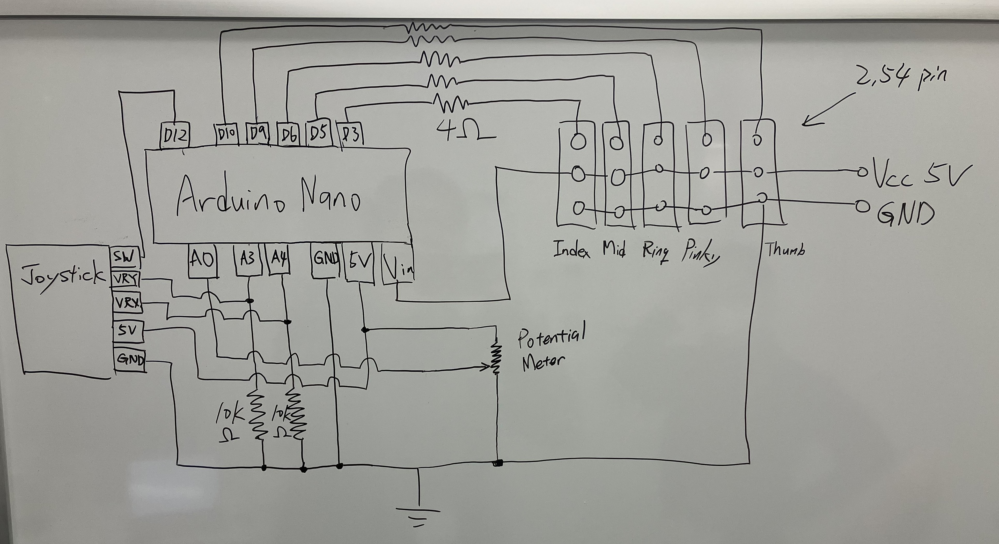

# HatsuHand Gesture Controller

This repository contains the Arduino code used to control the **HatsuHand** robotic hand. The project was featured in our YouTube content. This code enables control of the robotic hand using a joystick and potentiometer for dynamic gestures.

---

## Features

- **Gesture Control**: Use a joystick to manipulate the servos for individual fingers.
- **Adjustable Sensitivity**: Modify the hand's responsiveness with a potentiometer.
- **Simple Wiring**: Pins are pre-defined for easy connection and setup.

---

## Requirements

- **Hardware**:
  - Arduino nano
  - HatsuHand 
  - Joystick module (X, Y, Button input)
  - Potentiometer
  - Breadboard and wires
- **Libraries**:
  - `Servo.h` (Pre-installed with Arduino IDE)

---

## Pin Configuration

| Component         | Arduino Pin |
|--------------------|-------------|
| Joystick X-axis    | A4          |
| Joystick Y-axis    | A3          |
| Joystick Button    | 12          |
| Potentiometer      | A0          |
| Thumb Servo        | 10          |
| Index Servo        | 3           |
| Middle Servo       | 5           |
| Ring Servo         | 6           |
| Pinky Servo        | 9           |

---

## Setup and Usage

1. **Connect Hardware**:
   - Wire the joystick, potentiometer, and servos as specified in the pin configuration table.

2. **Upload Code**:
   - Open the provided `.ino` file in the Arduino IDE.
   - Select the correct board and port from the *Tools* menu.
   - Click *Upload* to upload the code to the Arduino board.

3. **Adjust Sensitivity**:
   - Use the potentiometer to fine-tune the responsiveness of the hand.

4. **Test Gestures**:
   - Move the joystick to control individual fingers.
   - Press the joystick button to toggle additional modes or functionalities.

---

## How It Works

- **Joystick Control**:
  - The X and Y axes of the joystick control the movement of specific fingers.
  - The button can be used for toggling different hand gestures or modes.

- **Servo Operation**:
  - The five servos control each finger of the robotic hand, using pulse width modulation (PWM).

- **Dynamic Sensitivity**:
  - The potentiometer adjusts the servo movement range

---

## Demo Video

Watch the full demonstration of this project on our YouTube channel:
[**"HatsuHandの義手化挑戦"**](#)

---

## License

This project is licensed under the MIT License.

---

## Acknowledgments

- Special thanks to everyone who supported the *HatsuHand* project.
