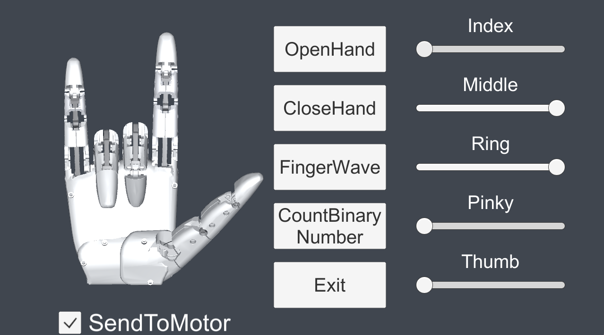

# FastDemo

This Unity demo is designed to simulate its operation and a control GUI.

## Usage

Connect your HatsuHand to your PC. And turn on start the program. Use this GUI interface to control a HatsuHand  with following functionalities and individual finger adjustments.

- **OpenHand**:
  - This button will command the hand to open fully, extending all fingers.

- **CloseHand**:
  - This button will command the hand to close into a fist, retracting all fingers.

- **FingerWave**:
  - Activating this function will make the fingers perform a waving motion

- **CountBinaryNumber**:
  - This feature allows the hand to count in binary numbers using finger movements.

- **SendToMotor**:
  - Check this Checkbox to allow sending the sliders information to HatsuHand

  - **Index, Middle, Ring, Pinky, and Thumb Sliders**:
    - These sliders allow you to adjust the individual movement of each finger. Moving a slider typically corresponds to bending or extending the finger depending on its current position and the direction of the adjustment.

- **Exit**:
  - Click this button to exit the application or end the current session.
