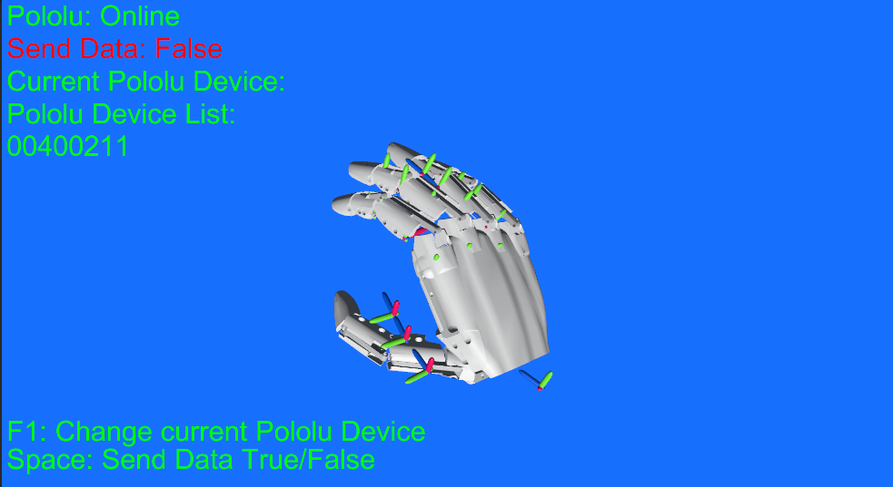
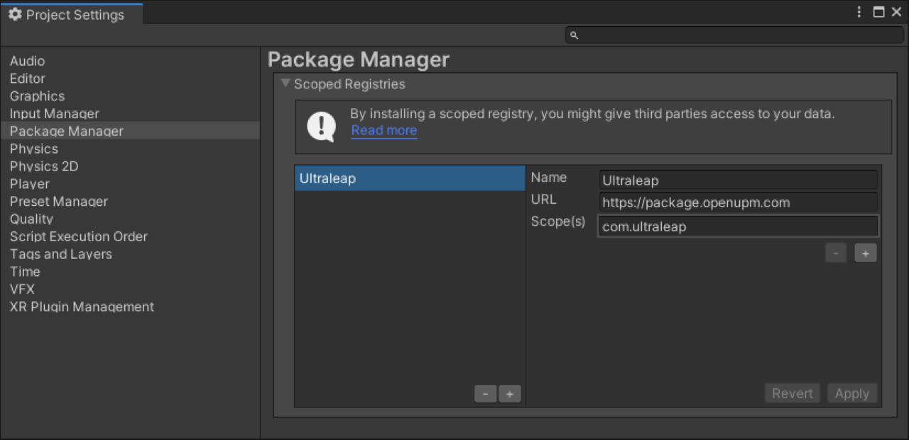
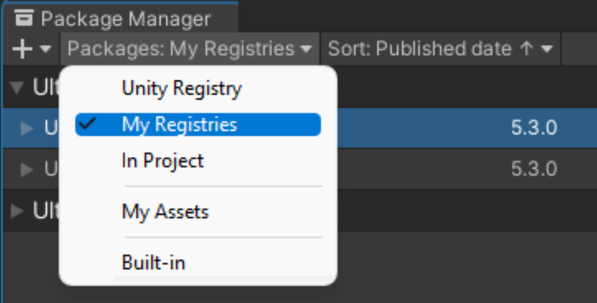
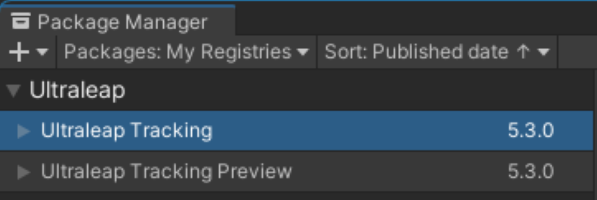
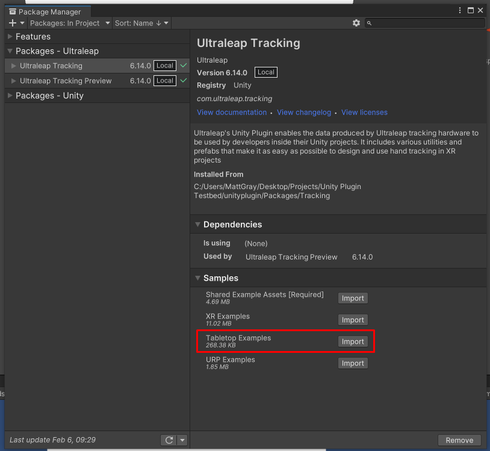
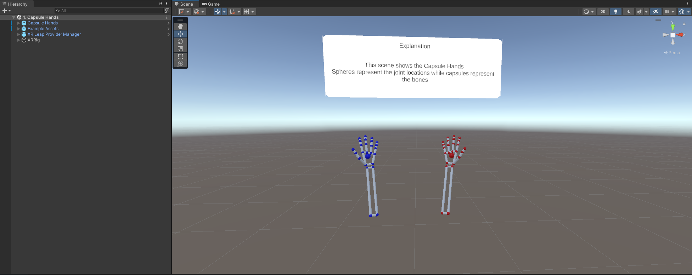
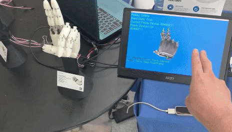

# LeapMotionDemo

## Overview

This Unity demo is designed to control HatsuHand through Leap Motion sensor.

## Prerequisites
### Hardware
- An Ultraleap Hand Tracking Camera
- A computer that meets the Tracking Requirements
- Ultraleap Hand Tracking Software (V5.2+) installed on the development computer. Also install the Hand Tracking Software for your specific XR device if building for an XR headset.

### Unity

- Unity 2021 LTS or newer
- Familiarity with Unity’s XR project setup
- Unity XR Plugin Management Package which can be installed from the Package manager window
- An XR runtime plugin Package. We recommend OpenXR where possible.

### Set up hand tracking in Unity
#### How to install (Refers to ultraleap official site [here](https://docs.ultraleap.com/xr-and-tabletop/xr/unity/getting-started/index.html))

1. Remove any existing Ultraleap Unity modules from your project
2. In Unity, select Edit -> Project Settings -> Package Manager, add a new scoped registry with the following details:
  - Name: Ultraleap
  - URL: https://package.openupm.com
  - Scope(s): com.ultraleap

3. Open the Package Manager (Window -> Package Manager) and navigate to “My Registries” in the dropdown at the top left of the window.

4. Ultraleap UPM packages should be available in the list. Add the “Ultraleap Tracking” package by selecting it in the list on the left then clicking install in the bottom right.

5. Include our example content, which demonstrates a lot of the features of the plugin and can be copied and expanded for your project, select the Samples for the package and import them via the Package Manager as shown below.

6. To Ensure that everything is set up and working, open the “Capsule Hands” scene in the package samples (Assets > Samples> Ultraleap Tracking > x.x.x > Examples > 1. XR Examples > 2. Building Blocks > 1. Basics > 1. Capsule Hands.unity). With these steps completed, when pressing play, you should be able to see your hands tracking in the scene.

## Demo Scene Usage

Once you run the scene, LeapMotion should start to recognize your hands by hovering about the Leap Motion Sensor. Press **Space** to start sending the detected bending to HatsuHand.

