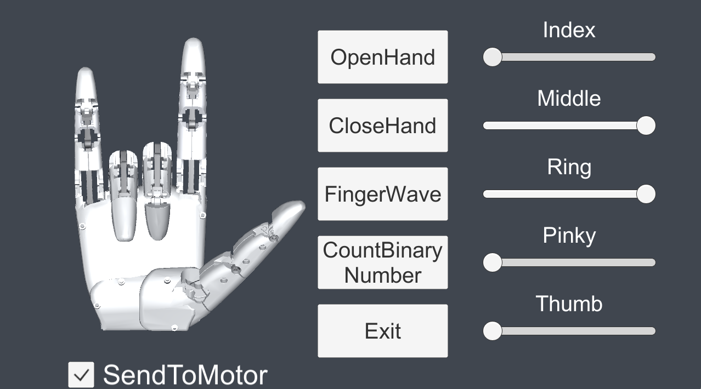

# HatsuHandFastTest

## Overview

This Unity project is designed to simulate its operation and a control GUI. You can try build version [here](./Build/HatsuHandFastTest_Build.7z)

## Demo Scene

The demo scene is located at the following path:
`Assets\HatsuHandSimulator\Simulator.unity`

## Requirements

- Unity 2020.3 or later
- [DOTween](http://dotween.demigiant.com/)
- HatsuHand with Maestro USB control interface

## Project Setup Prerequirements

**Enabling the .NET 4.x scripting runtime in Unity**

You will need to setup .NET 4.X support in order to start. To enable the .NET 4.x scripting runtime, take the following steps:
- Open PlayerSettings in the Unity Inspector by selecting Edit > Project Settings > Player > Other Settings.
- Under the Configuration heading, click the Api compatibility Level dropdown and select .NET Framework. You'll be prompted to restart Unity.

## Usage

Connect your HatsuHand to your PC. And turn on start the program. Use this GUI interface to control a HatsuHand  with following functionalities and individual finger adjustments.

- **OpenHand**:
  - This button will command the hand to open fully, extending all fingers.

- **CloseHand**:
  - This button will command the hand to close into a fist, retracting all fingers.

- **FingerWave**:
  - Activating this function will make the fingers perform a waving motion

- **CountBinaryNumber**:
  - This feature allows the hand to count in binary numbers using finger movements.

- **SendToMotor**:
  - Check this Checkbox to allow sending the sliders information to HatsuHand

  - **Index, Middle, Ring, Pinky, and Thumb Sliders**:
    - These sliders allow you to adjust the individual movement of each finger. Moving a slider typically corresponds to bending or extending the finger depending on its current position and the direction of the adjustment.

- **Exit**:
  - Click this button to exit the application or end the current session.

## License

This project is released under the MIT License.

**Third-Party Licenses**

- **Pololu USB SDK**
  - Some code is used from the [Pololu USB SDK](https://github.com/pololu/pololu-usb-sdk/tree/master/Maestro/MaestroEasyExample).
  - The MIT License applies.

## Contact

If you have any questions or need support, please reach out via the [HatsuMuv Discord](https://discord.gg/JbysAbJWCN).
