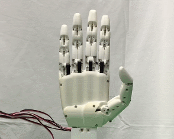
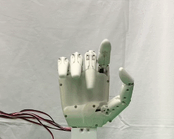

# HatsuHand Mk.I Example

This project provides an example code for controlling a 5-DOF robot hand using a Pololu Maestro servo motor controller. The example includes a GUI that demonstrates basic hand movements such as opening, closing, performing a finger wave, and counting in binary using the hand's fingers.

## Features

- **Open Hand**: Demonstrates how to open all fingers of the robot hand.
- **Close Hand**: Demonstrates how to close all fingers of the robot hand.
- **Finger Wave**: A simple example of sequentially moving fingers in a wave-like motion.
- **Count Binary Number**: Uses finger positions to represent binary digits and count from 1 to 15.
- **Exit**: Closes the application.

## Gif Demo
### Open and Close Hand
This animation demonstrates the robot hand opening and closing, illustrating the range of motion and control capabilities.



### Finger Wave
The finger wave animation shows how each finger can move independently, mimicking a human-like wave.



### Counting in Binary
This gif showcases the robot hand counting in binary, a demonstration of precise finger control and coordination.


## Prerequisites

- Python 3.x
- Pololu Maestro servo motor controller with 5 DOF robot hand

### Python Packages

Install the required packages with:

```
pip install -r requirements.txt
```

The following packages are required:

- **pyserial**: For serial communication with the Pololu Maestro controller.


## File Overview
- **HatsuHandFastDemo.py**: Main script that launches the GUI for controlling the robot hand. It uses the RobotHandAPI class to interface with the Pololu Maestro controller.
- **HatsuHandAPI.py**: Defines the RobotHandAPI class, which abstracts the functions needed to control the robot hand's servos.
- **HatsuHandFastDemo.bat**: Windows batch file to execute the demo for testing purposes.
- **requirements.txt**: Python dependencies for the project.

## How to Run
- Connect the Pololu Maestro controller to your PC.
- Ensure the correct COM port is being used in the HatsuHandAPI.py file.
- Run the GUI by executing the HatsuHandFastDemo.py script:
```
python HatsuHandFastDemo.py
```

The GUI should display buttons for controlling the hand.

## Windows Users
You can also use the provided batch file (HatsuHandFastTest.bat) to run the demo:
```
HatsuHandFastTest.bat
```

## Usage
Once the application is running, use the following controls:

- Open Hand: Opens all the fingers of the robot hand.
- Close Hand: Closes all the fingers of the robot hand.
- Finger Wave: Performs a wave motion by sequentially closing and opening the fingers.
- Count Binary Number: Moves the fingers to represent binary numbers.
- Exit: Closes the application.

## Code Structure

- **RobotHandAPI**: Provides functions to control the servos using serial communication with the Pololu Maestro controller.
  - `set_motor_position(motor_index, target)`: Moves a specific motor to a target position.
  - `set_motor_speed(motor_index, speed)`: Sets the movement speed for a motor.
  - `set_motor_acceleration(motor_index, acceleration)`: Sets the acceleration for a motor.
  - `get_motor_position(motor_index)`: Retrieves the current position of a motor.
  - `is_motor_moving(motor_index)`: Checks if a motor is currently moving.
  - `stop_all_motors()`: Stops all motors.
  - Context management is supported with the `__enter__` and `__exit__` methods for safe usage with `with` statements.

## Troubleshooting

- Ensure the correct COM port for the Pololu Maestro controller is detected. If no device is found, an exception will be raised, and the program will terminate.
- Verify the Python packages are installed correctly by running:

```bash
pip install -r requirements.txt
```

## License
This project is licensed under the MIT License.